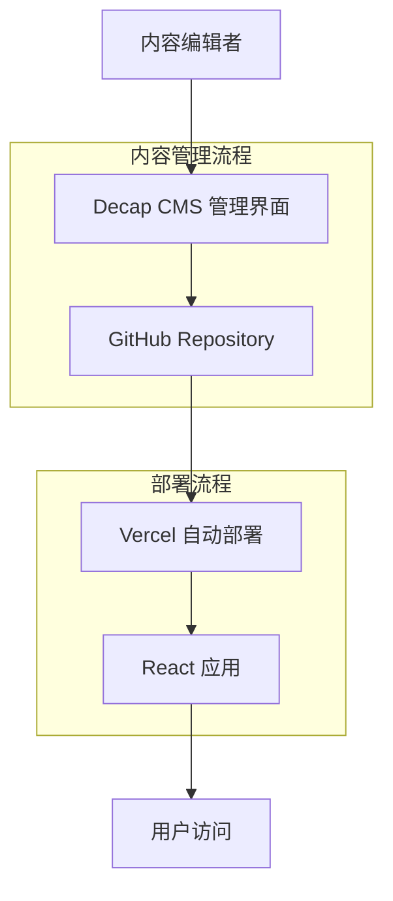
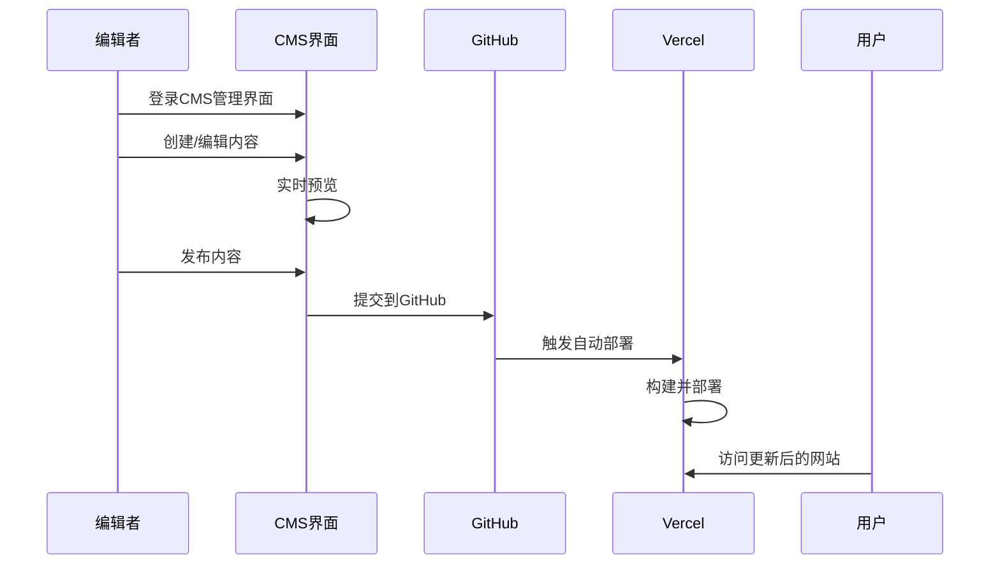

# 内容管理系统(CMS)集成技术方案

## 1. 项目现状分析

### 1.1 当前内容管理痛点
- **静态数据管理**：车型数据和情报文章存储在静态JSON文件中(`public/data/intelligence.json`, `public/data/models.json`)
- **手动更新流程**：每次内容更新需要手动编辑JSON文件，容易出错且效率低下
- **版本控制复杂**：内容更新需要通过Git提交，非技术人员难以操作
- **扩展性限制**：随着内容增长，JSON文件将变得庞大且难以维护
- **协作困难**：多人编辑容易产生冲突，缺乏内容审核流程

### 1.2 技术架构现状
- **前端框架**：React 19.1.1 + TypeScript + Vite
- **路由管理**：React Router DOM 7.9.1
- **部署平台**：Vercel
- **数据获取**：通过fetch API读取静态JSON文件
- **样式方案**：Tailwind CSS (通过类名推断)

## 2. CMS方案技术选型分析

### 2.1 Decap CMS (推荐方案)

**优势：**
- ✅ **零成本**：完全免费的开源解决方案
- ✅ **Git集成**：直接与GitHub仓库集成，保持现有工作流
- ✅ **简单部署**：只需添加配置文件，无需额外服务器
- ✅ **即时预览**：支持内容编辑的实时预览
- ✅ **权限管理**：支持GitHub OAuth认证
- ✅ **媒体管理**：内置图片上传和管理功能

**技术特点：**
- 基于Git的内容管理
- 支持Markdown和结构化数据编辑
- 与Vercel部署完美兼容
- 支持自定义字段类型

**适用性评分：9/10**

### 2.2 Strapi (备选方案)

**优势：**
- ✅ **功能强大**：完整的无头CMS功能
- ✅ **API优先**：RESTful和GraphQL API支持
- ✅ **用户管理**：内置用户角色和权限系统
- ✅ **插件生态**：丰富的插件扩展

**劣势：**
- ❌ **部署复杂**：需要独立服务器或云服务
- ❌ **成本较高**：需要数据库和服务器资源
- ❌ **学习曲线**：配置和维护相对复杂

**适用性评分：6/10**

### 2.3 Sanity (备选方案)

**优势：**
- ✅ **实时协作**：多人实时编辑支持
- ✅ **强大编辑器**：富文本编辑体验优秀
- ✅ **CDN支持**：全球内容分发网络

**劣势：**
- ❌ **付费服务**：免费额度有限
- ❌ **学习成本**：需要学习Sanity特有的查询语言
- ❌ **依赖性**：完全依赖第三方服务

**适用性评分：7/10**

### 2.4 Contentful (备选方案)

**优势：**
- ✅ **企业级**：成熟的企业级CMS解决方案
- ✅ **API性能**：高性能的内容交付API
- ✅ **多语言支持**：国际化功能完善

**劣势：**
- ❌ **成本高昂**：付费服务，价格较高
- ❌ **过度设计**：对于当前项目规模过于复杂
- ❌ **厂商锁定**：迁移成本高

**适用性评分：5/10**

## 3. 推荐方案：Decap CMS集成

### 3.1 选择理由
1. **成本效益最优**：完全免费，无额外运营成本
2. **技术栈匹配**：与现有React + Vercel架构完美兼容
3. **学习成本低**：配置简单，快速上手
4. **维护成本低**：无需额外服务器维护
5. **数据安全**：数据存储在自己的Git仓库中

### 3.2 集成架构设计



## 4. 详细实施计划

### 4.1 阶段一：基础配置 (1-2天)

**步骤1：安装Decap CMS**
```bash
npm install decap-cms-app
```

**步骤2：创建CMS配置文件**
创建 `public/admin/config.yml`：
```yaml
backend:
  name: git-gateway
  branch: main

media_folder: public/images/uploads
public_folder: /images/uploads

collections:
  - name: "intelligence"
    label: "Intelligence Articles"
    folder: "content/intelligence"
    create: true
    slug: "{{year}}-{{month}}-{{day}}-{{slug}}"
    fields:
      - {label: "Title", name: "title", widget: "string"}
      - {label: "Date", name: "date", widget: "datetime"}
      - {label: "Brand", name: "brand", widget: "select", options: ["NIO", "Xiaomi", "BYD", "Li Auto", "Zeekr", "XPeng"]}
      - {label: "Model", name: "model", widget: "string"}
      - {label: "Source", name: "source", widget: "string"}
      - {label: "Status", name: "status", widget: "select", options: ["Official Announcement", "MIIT Filed", "Rumor", "Confirmed Plan", "Unconfirmed"]}
      - {label: "Confidence", name: "confidence", widget: "select", options: ["A", "B", "C"]}
      - {label: "Pro Content", name: "is_pro", widget: "boolean", default: false}
      - {label: "Content", name: "content", widget: "markdown"}
```

**步骤3：创建管理界面入口**
创建 `public/admin/index.html`：
```html
<!doctype html>
<html>
<head>
  <meta charset="utf-8" />
  <meta name="viewport" content="width=device-width, initial-scale=1.0" />
  <title>Content Manager</title>
</head>
<body>
  <script src="https://unpkg.com/decap-cms@^3.0.0/dist/decap-cms.js"></script>
</body>
</html>
```

### 4.2 阶段二：数据结构迁移 (2-3天)

**车型数据配置：**
```yaml
  - name: "models"
    label: "Car Models"
    folder: "content/models"
    create: true
    slug: "{{brand}}-{{model_name}}"
    fields:
      - {label: "Brand", name: "brand", widget: "string"}
      - {label: "Model Name", name: "model_name", widget: "string"}
      - {label: "Status", name: "status", widget: "select", options: ["On Sale (China)", "Pre-order", "Limited Production", "Concept"]}
      - {label: "CEO Note", name: "ceo_note", widget: "text"}
      - {label: "Images", name: "images", widget: "list", field: {label: "Image URL", name: "url", widget: "string"}}
      - label: "Price Range (USD)"
        name: "price_usd_estimated"
        widget: "object"
        fields:
          - {label: "Min Price", name: "min", widget: "number"}
          - {label: "Max Price", name: "max", widget: "number"}
      - label: "Key Specifications"
        name: "key_specs"
        widget: "object"
        fields:
          - {label: "Range (CLTC)", name: "range_cltc", widget: "string"}
          - {label: "0-100 km/h", name: "zero_to_100", widget: "string"}
          - {label: "Power (kW)", name: "power_kw", widget: "string"}
          - {label: "Battery (kWh)", name: "battery_kwh", widget: "string"}
```

### 4.3 阶段三：API集成改造 (3-4天)

**创建内容聚合服务：**
```typescript
// utils/contentService.ts
export class ContentService {
  static async getIntelligenceItems(): Promise<IntelligenceItem[]> {
    try {
      // 尝试从CMS获取数据
      const cmsData = await this.fetchFromCMS('/intelligence');
      if (cmsData) return cmsData;
      
      // 降级到静态JSON
      const response = await fetch('/data/intelligence.json');
      return await response.json();
    } catch (error) {
      console.error('Failed to fetch intelligence data:', error);
      return [];
    }
  }
  
  static async getCarModels(): Promise<CarModel[]> {
    try {
      const cmsData = await this.fetchFromCMS('/models');
      if (cmsData) return cmsData;
      
      const response = await fetch('/data/models.json');
      return await response.json();
    } catch (error) {
      console.error('Failed to fetch models data:', error);
      return [];
    }
  }
  
  private static async fetchFromCMS(endpoint: string) {
    // CMS API集成逻辑
    // 这里可以集成GitHub API或其他数据源
  }
}
```

**更新组件数据获取：**
```typescript
// 在HomePage.tsx中
useEffect(() => {
  const fetchLatestIntel = async () => {
    try {
      const data = await ContentService.getIntelligenceItems();
      data.sort((a, b) => new Date(b.date).getTime() - new Date(a.date).getTime());
      setLatestIntel(data.slice(0, 3));
    } catch (error) {
      console.error("Failed to fetch latest intelligence:", error);
    }
  };
  fetchLatestIntel();
}, []);
```

### 4.4 阶段四：内容迁移 (1-2天)

**数据迁移脚本：**
```javascript
// scripts/migrateContent.js
const fs = require('fs');
const path = require('path');

// 将现有JSON数据转换为Markdown文件
function migrateIntelligence() {
  const intelligenceData = JSON.parse(
    fs.readFileSync('public/data/intelligence.json', 'utf8')
  );
  
  intelligenceData.forEach(item => {
    const frontmatter = `---
title: "${item.title}"
date: ${item.date}
brand: ${item.brand}
model: ${item.model}
source: "${item.source}"
status: ${item.status}
confidence: ${item.confidence}
is_pro: ${item.is_pro}
---

${item.content}`;
    
    const filename = `${item.date}-${item.id}.md`;
    fs.writeFileSync(
      path.join('content/intelligence', filename),
      frontmatter
    );
  });
}
```

### 4.5 阶段五：权限配置与测试 (1天)

**GitHub OAuth配置：**
1. 在GitHub仓库设置中启用GitHub Pages
2. 配置OAuth应用
3. 设置Netlify Identity (如果使用)
4. 测试管理界面访问权限

## 5. CMS集成后的工作流程优化

### 5.1 内容创建流程


### 5.2 内容管理优势
- **可视化编辑**：富文本编辑器，支持Markdown
- **媒体管理**：拖拽上传图片，自动优化
- **版本控制**：每次编辑都有Git历史记录
- **协作流程**：支持草稿、审核、发布流程
- **移动友好**：响应式管理界面，支持移动设备

## 6. 技术实施考虑

### 6.1 性能优化
- **静态生成**：利用Vercel的静态生成能力
- **增量构建**：只重新构建变更的内容
- **CDN缓存**：利用Vercel的全球CDN
- **图片优化**：自动压缩和格式转换

### 6.2 SEO优化
- **元数据管理**：CMS中配置SEO字段
- **结构化数据**：自动生成JSON-LD
- **站点地图**：动态生成sitemap.xml
- **社交分享**：Open Graph和Twitter Cards

### 6.3 安全考虑
- **访问控制**：GitHub OAuth认证
- **内容审核**：Pull Request工作流
- **备份策略**：Git历史作为天然备份
- **HTTPS强制**：Vercel默认HTTPS

## 7. 实施复杂度与成本评估

### 7.1 开发成本
- **初始开发**：5-8个工作日
- **测试调试**：2-3个工作日
- **内容迁移**：1-2个工作日
- **总计**：8-13个工作日

### 7.2 运营成本
- **CMS服务**：$0/月 (Decap CMS免费)
- **存储成本**：$0/月 (GitHub免费额度)
- **部署成本**：$0/月 (Vercel免费额度)
- **总运营成本**：$0/月

### 7.3 维护成本
- **日常维护**：极低，主要是内容更新
- **技术维护**：偶尔更新CMS版本
- **培训成本**：低，界面直观易用

### 7.4 风险评估
- **技术风险**：低，成熟的开源方案
- **迁移风险**：低，可以渐进式迁移
- **依赖风险**：低，可以随时回退到静态文件
- **学习风险**：低，用户界面友好

## 8. 长期发展规划

### 8.1 功能扩展
- **多语言支持**：国际化内容管理
- **用户生成内容**：评论和评分系统
- **API开放**：为第三方应用提供数据接口
- **高级分析**：内容表现和用户行为分析

### 8.2 技术演进
- **无服务器函数**：复杂业务逻辑处理
- **实时更新**：WebSocket或Server-Sent Events
- **AI集成**：内容推荐和自动标签
- **移动应用**：React Native或PWA

## 9. 实施建议

### 9.1 实施策略
1. **渐进式迁移**：先迁移情报文章，再迁移车型数据
2. **并行开发**：CMS配置与前端改造同步进行
3. **充分测试**：在staging环境完整测试后再上线
4. **用户培训**：为内容编辑者提供使用培训

### 9.2 成功指标
- **内容更新频率**：从周更新提升到日更新
- **编辑效率**：内容发布时间减少80%
- **错误率降低**：人工编辑错误减少90%
- **协作效率**：支持多人同时编辑

### 9.3 应急预案
- **回退机制**：保留原有静态文件作为备份
- **数据备份**：定期导出CMS数据
- **监控告警**：部署状态和内容同步监控
- **技术支持**：建立技术支持联系渠道

## 10. 结论

Decap CMS集成方案为中国电动车情报平台提供了最优的内容管理解决方案。该方案具有零成本、低风险、易维护的特点，能够显著提升内容管理效率，为平台的快速发展奠定坚实基础。

通过实施此方案，平台将实现：
- **生产力解放**：从手动编辑JSON到可视化内容管理
- **协作效率提升**：多人协作，版本控制，审核流程
- **扩展性增强**：为未来功能扩展预留充足空间
- **用户体验优化**：更频繁的内容更新，更丰富的信息

建议立即启动实施，预计2周内可以完成完整的CMS集成，为平台的下一阶段发展提供强有力的技术支撑。