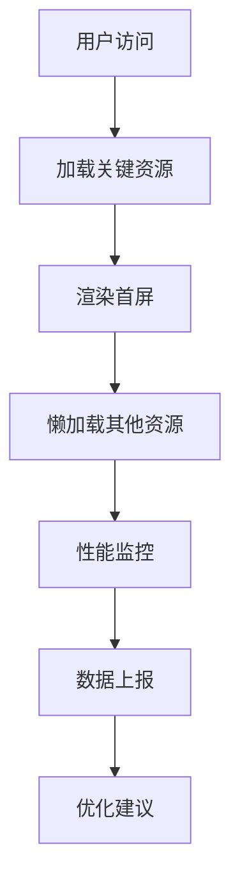
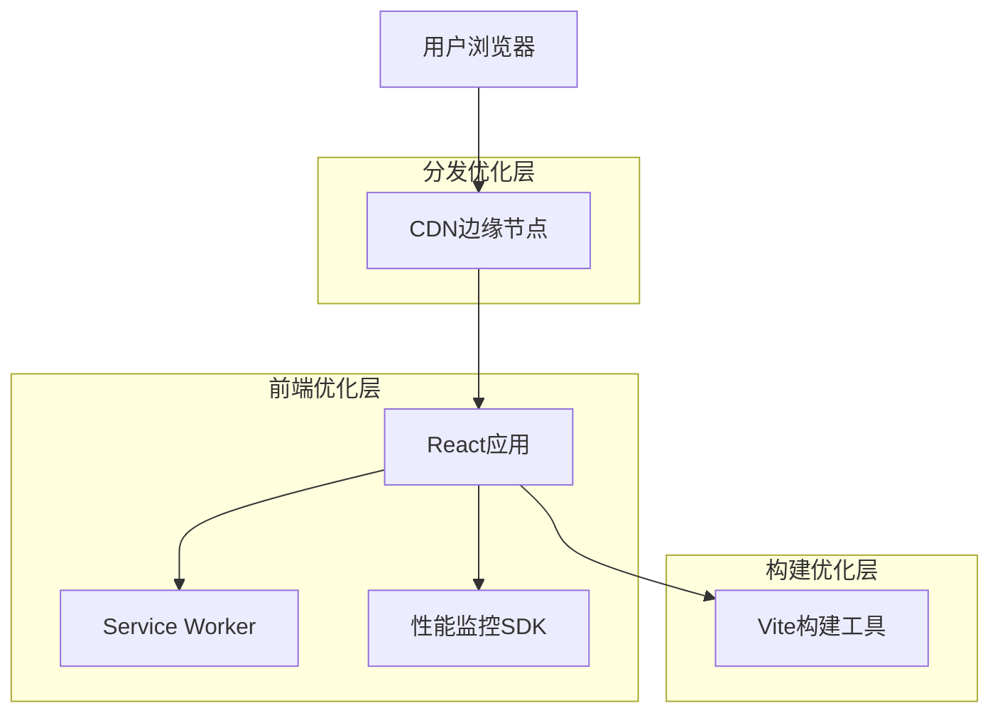

# 前端性能优化技术方案

## 1. 产品概述

本文档针对China EV Intelligence网站的前端性能优化提供全面的技术方案。通过系统性的性能分析和优化策略，显著提升网站加载速度和用户体验，确保在各种网络环境下都能提供流畅的访问体验。

## 2. 核心功能

### 2.1 用户角色

| 角色 | 访问方式 | 核心权限 |
|------|----------|----------|
| 普通用户 | 直接访问 | 浏览基础内容，体验优化后的快速加载 |
| 高级用户 | 会员登录 | 访问高级内容，享受优先加载策略 |
| 管理员 | 后台登录 | 监控性能指标，管理优化配置 |

### 2.2 功能模块

我们的前端性能优化方案包含以下核心模块：
1. **性能分析模块**：网站性能现状评估，瓶颈识别
2. **代码优化模块**：代码分割，懒加载，预加载策略
3. **资源优化模块**：图片压缩，字体优化，静态资源管理
4. **缓存策略模块**：浏览器缓存，CDN配置，服务端缓存
5. **监控报告模块**：性能指标监控，用户体验追踪

### 2.3 页面详情

| 页面名称 | 模块名称 | 功能描述 |
|----------|----------|----------|
| 首页 | 关键资源预加载 | 优先加载首屏内容，延迟加载非关键资源，实现秒开体验 |
| 情报页面 | 虚拟滚动 | 大量数据列表采用虚拟滚动，减少DOM节点，提升滚动性能 |
| 详情页面 | 图片懒加载 | 图片按需加载，WebP格式优化，响应式图片处理 |
| 搜索页面 | 防抖优化 | 搜索输入防抖，结果缓存，提升搜索响应速度 |
| 数据库页面 | 分页加载 | 数据分页加载，无限滚动优化，减少初始加载时间 |

## 3. 核心流程

### 用户访问流程
用户访问网站时，首先加载关键CSS和JavaScript，然后渐进式加载其他资源。通过Service Worker实现离线缓存，确保重复访问时的极速体验。

### 性能监控流程
实时监控Core Web Vitals指标（LCP、FID、CLS），通过性能API收集数据，自动生成性能报告并触发优化建议。



## 4. 用户界面设计

### 4.1 设计风格

- **主色调**：保持现有的蓝色主题 (#667eea)，确保视觉一致性
- **加载动画**：简洁的骨架屏和进度指示器，减少用户等待焦虑
- **字体优化**：使用系统字体栈，减少字体加载时间
- **布局策略**：移动优先设计，确保小屏设备的优秀体验
- **交互反馈**：即时的视觉反馈，提升用户操作体验

### 4.2 页面设计概览

| 页面名称 | 模块名称 | UI元素 |
|----------|----------|--------|
| 首页 | 骨架屏加载 | 渐进式内容显示，平滑的加载动画，优化的图片展示 |
| 列表页 | 虚拟滚动 | 流畅的滚动体验，智能预加载，无缝的分页切换 |
| 详情页 | 懒加载组件 | 按需加载的内容模块，优化的图片展示，快速的页面切换 |

### 4.3 响应式设计

采用移动优先的响应式设计策略，确保在各种设备上都能提供优秀的性能表现。针对不同屏幕尺寸优化资源加载策略。

## 5. 技术架构

### 5.1 架构设计



### 5.2 技术描述

- **前端框架**：React@18 + TypeScript + Vite
- **构建优化**：代码分割、Tree Shaking、压缩混淆
- **缓存策略**：Service Worker + HTTP缓存 + CDN缓存
- **监控工具**：Web Vitals + Performance API + 自定义监控

### 5.3 路由定义

| 路由 | 用途 | 优化策略 |
|------|------|----------|
| / | 首页 | 关键资源预加载，首屏优化 |
| /intelligence | 情报列表 | 虚拟滚动，分页加载 |
| /intelligence/:id | 情报详情 | 懒加载，图片优化 |
| /database | 数据库 | 数据分页，缓存策略 |
| /search | 搜索页面 | 防抖优化，结果缓存 |

## 6. 性能优化策略

### 6.1 代码层面优化

**代码分割（Code Splitting）**
```typescript
// 路由级别的代码分割
const IntelligencePage = lazy(() => import('./pages/IntelligencePage'));
const DatabasePage = lazy(() => import('./pages/DatabasePage'));

// 组件级别的代码分割
const HeavyComponent = lazy(() => import('./components/HeavyComponent'));
```

**Tree Shaking优化**
- 使用ES6模块语法
- 避免导入整个库，按需导入
- 配置Vite的rollupOptions进行精确的依赖分析

**Bundle分析和优化**
- 使用rollup-plugin-visualizer分析包大小
- 识别和移除重复依赖
- 优化第三方库的使用

### 6.2 资源优化

**图片优化策略**
- WebP格式转换，降级到JPEG/PNG
- 响应式图片，根据设备提供合适尺寸
- 图片懒加载，减少初始加载时间
- 图片压缩，保持质量的同时减小文件大小

**字体优化**
- 使用系统字体栈减少网络请求
- 字体预加载关键字体文件
- 字体显示策略优化（font-display: swap）

**CSS和JavaScript优化**
- CSS关键路径优化，内联关键CSS
- JavaScript延迟加载非关键脚本
- 资源压缩和混淆

### 6.3 缓存策略

**浏览器缓存**
- 静态资源长期缓存（1年）
- HTML文件短期缓存（5分钟）
- API响应适度缓存（30分钟）

**Service Worker缓存**
- 关键资源预缓存
- 运行时缓存策略
- 缓存更新机制

**CDN配置**
- 全球边缘节点分发
- 智能路由优化
- 压缩传输（Gzip/Brotli）

### 6.4 运行时优化

**React性能优化**
- 使用React.memo避免不必要的重渲染
- useMemo和useCallback优化计算和函数
- 虚拟滚动处理大量数据
- Suspense和ErrorBoundary提升用户体验

**DOM操作优化**
- 减少DOM查询和操作
- 批量DOM更新
- 使用DocumentFragment优化大量DOM插入

**内存管理**
- 及时清理事件监听器
- 避免内存泄漏
- 优化大对象的使用

## 7. 性能监控指标

### 7.1 Core Web Vitals

**Largest Contentful Paint (LCP)**
- 目标：< 2.5秒
- 监控最大内容绘制时间
- 优化策略：图片优化、关键资源预加载

**First Input Delay (FID)**
- 目标：< 100毫秒
- 监控首次输入延迟
- 优化策略：代码分割、主线程优化

**Cumulative Layout Shift (CLS)**
- 目标：< 0.1
- 监控累积布局偏移
- 优化策略：图片尺寸预设、字体加载优化

### 7.2 自定义性能指标

**页面加载时间**
- 首屏渲染时间（FCP）
- 页面完全加载时间（Load）
- 交互就绪时间（TTI）

**资源加载性能**
- 资源加载时间分布
- 缓存命中率
- CDN性能表现

**用户体验指标**
- 页面跳出率
- 用户停留时间
- 交互响应时间

### 7.3 监控实施方案

**数据收集**
```typescript
// 性能数据收集
const observer = new PerformanceObserver((list) => {
  for (const entry of list.getEntries()) {
    // 发送性能数据到监控服务
    sendPerformanceData(entry);
  }
});

observer.observe({entryTypes: ['navigation', 'paint', 'largest-contentful-paint']});
```

**实时监控**
- 性能数据实时上报
- 异常情况自动告警
- 性能趋势分析

**报告生成**
- 每日性能报告
- 性能对比分析
- 优化建议生成

## 8. 实施计划

### 8.1 第一阶段：基础优化（1-2周）
- 代码分割实施
- 图片懒加载优化
- 基础缓存策略配置
- 性能监控系统搭建

### 8.2 第二阶段：深度优化（2-3周）
- Service Worker实施
- CDN配置优化
- React性能优化
- 虚拟滚动实现

### 8.3 第三阶段：监控完善（1周）
- 性能监控完善
- 自动化性能测试
- 性能报告系统
- 持续优化机制

### 8.4 验收标准
- LCP < 2.5秒
- FID < 100毫秒
- CLS < 0.1
- 首屏加载时间 < 1.5秒
- 页面切换响应时间 < 200毫秒

## 9. 风险评估与应对

### 9.1 技术风险
- **兼容性问题**：充分测试各浏览器兼容性
- **缓存问题**：建立缓存更新机制
- **性能回归**：建立性能监控和告警机制

### 9.2 业务风险
- **用户体验中断**：分阶段发布，灰度测试
- **SEO影响**：确保优化不影响搜索引擎抓取
- **功能异常**：完善的测试覆盖和回滚机制

## 10. 总结

通过系统性的前端性能优化，我们将