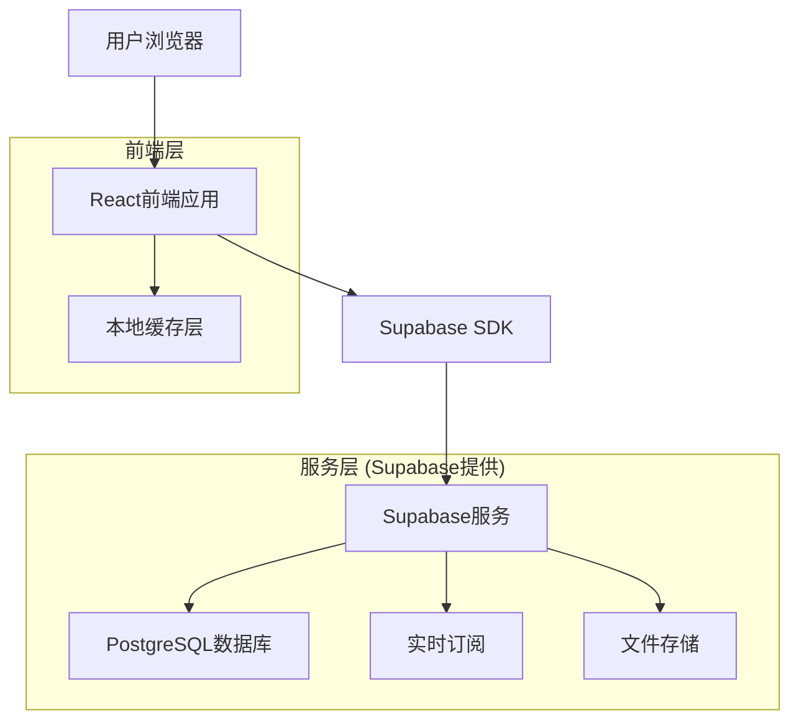

# 可扩展报告管理系统技术架构

## 1. 架构设计

```mermaid
graph TD
  A[用户浏览器] --> B[React前端应用]
  B --> C[Supabase SDK]
  C --> D[Supabase服务]
  B --> E[本地缓存层]
  
  subgraph "前端层"
    B
    E
  end
  
  subgraph "服务层 (Supabase提供)"
    D
    F[PostgreSQL数据库]
    G[实时订阅]
    H[文件存储]
  end
  
  D --> F
  D --> G
  D --> H
```

## 2. 技术描述

- 前端：React@18 + TypeScript + TailwindCSS@3 + Vite
- 后端：Supabase (PostgreSQL + 实时API + 认证)
- 缓存：React Query + 浏览器本地存储
- 搜索：PostgreSQL全文搜索 