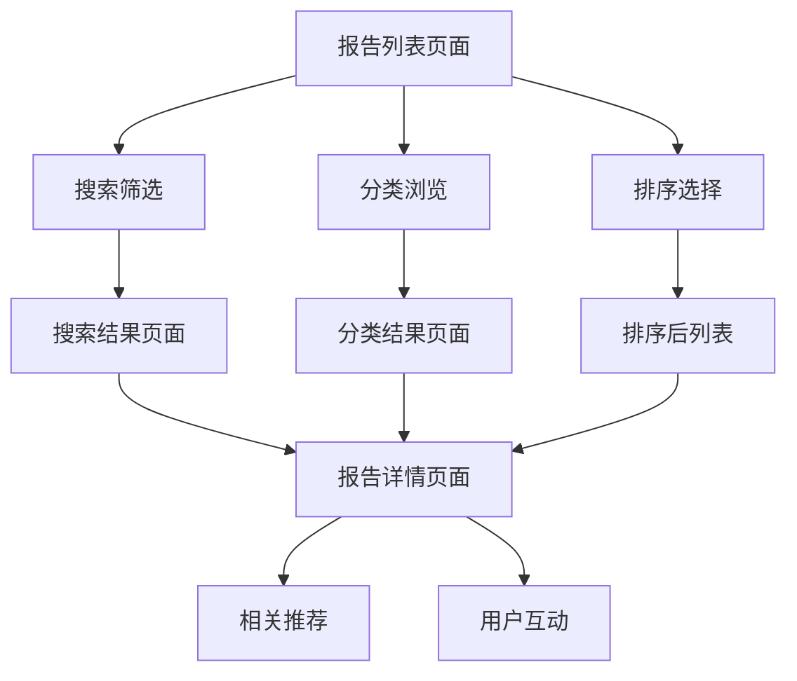

# 可扩展报告管理系统需求文档

## 1. 产品概述

针对用户担心的"几十篇报告管理"问题，设计一个可扩展的报告管理系统，提供高效的报告浏览、搜索和管理功能。
- 解决大量报告的组织和查找问题，提升用户浏览体验
- 为内容创作者和读者提供便捷的报告管理和发现机制

## 2. 核心功能

### 2.1 用户角色

| 角色 | 注册方式 | 核心权限 |
|------|----------|----------|
| 普通用户 | 邮箱注册 | 浏览报告、搜索、收藏 |
| 高级用户 | 付费升级 | 下载报告、高级筛选、批量操作 |
| 管理员 | 后台分配 | 发布报告、分类管理、数据统计 |

### 2.2 功能模块

我们的可扩展报告管理系统包含以下核心页面：
1. **报告列表页面**：分页显示、搜索筛选、分类导航
2. **报告详情页面**：完整报告内容、相关推荐、用户互动
3. **报告管理页面**：后台管理、批量操作、统计分析
4. **搜索结果页面**：高级搜索、结果排序、筛选条件

### 2.3 页面详情

| 页面名称 | 模块名称 | 功能描述 |
|----------|----------|----------|
| 报告列表页面 | 分页组件 | 支持每页10/20/50条记录，无限滚动加载 |
| 报告列表页面 | 搜索筛选栏 | 关键词搜索、日期范围、分类筛选、标签筛选 |
| 报告列表页面 | 排序功能 | 按发布时间、热度、评分、阅读量排序 |
| 报告列表页面 | 分类导航 | 行业分类、地区分类、报告类型分类 |
| 报告详情页面 | 内容渲染 | 支持HTML、图表、交互元素渲染 |
| 报告详情页面 | 相关推荐 | 基于标签和分类的智能推荐 |
| 报告详情页面 | 用户互动 | 收藏、分享、评论、评分功能 |
| 报告管理页面 | 批量操作 | 批量编辑、删除、分类、标签管理 |
| 报告管理页面 | 统计分析 | 阅读量统计、用户行为分析、热门报告 |
| 搜索结果页面 | 高级搜索 | 多条件组合搜索、搜索历史、搜索建议 |

## 3. 核心流程

**用户浏览流程：**
用户进入报告列表页面 → 使用搜索/筛选功能缩小范围 → 选择排序方式 → 浏览报告卡片 → 点击进入详情页面 → 阅读完整报告 → 进行互动操作

**管理员发布流程：**
管理员登录后台 → 创建新报告 → 设置分类和标签 → 上传HTML内容 → 预览效果 → 发布报告 → 监控数据统计

## 4. 用户界面设计

### 4.1 设计风格
- 主色调：深蓝色 (#1e293b)，辅助色：蓝色 (#3b82f6)
- 按钮样式：圆角按钮，悬停效果，渐变背景
- 字体：系统默认字体，标题16-24px，正文14-16px
- 布局风格：卡片式布局，响应式设计，左侧导航
- 图标风格：线性图标，统一风格，适当动画效果

### 4.2 页面设计概览

| 页面名称 | 模块名称 | UI元素 |
|----------|----------|--------|
| 报告列表页面 | 搜索筛选栏 | 搜索框、下拉筛选器、日期选择器、标签云 |
| 报告列表页面 | 报告卡片 | 缩略图、标题、摘要、标签、发布时间、阅读量 |
| 报告列表页面 | 分页组件 | 页码导航、每页条数选择、总数显示 |
| 报告详情页面 | 报告头部 | 标题、作者、发布时间、分类、标签、操作按钮 |
| 报告详情页面 | 内容区域 | HTML渲染区、图表展示、交互元素 |
| 报告详情页面 | 侧边栏 | 目录导航、相关推荐、热门报告 |

### 4.3 响应式设计
桌面优先设计，支持平板和手机适配，触摸交互优化，侧边栏在移动端收缩为抽屉式导航。