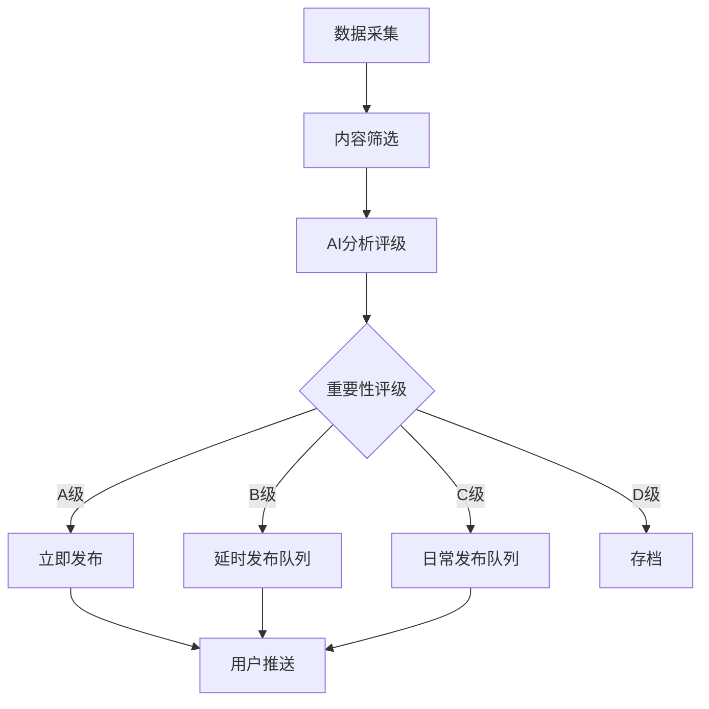
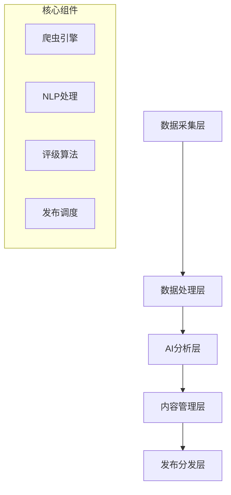

# 自动化情报收集系统技术方案

## 1. 系统概述

本方案旨在为China EV Intelligence平台构建一个全自动化的情报收集、处理和发布系统，最大程度减少人工干预，同时确保内容质量和时效性。

**核心目标：**
- 实现90%以上的内容自动化处理
- 7x24小时不间断情报收集
- 智能筛选和质量控制
- 最小化运营成本和人力投入

## 2. 自动化数据源集成

### 2.1 新闻媒体API集成
| 数据源 | 类型 | 更新频率 | 成本估算 |
|--------|------|----------|----------|
| 新浪财经API | 财经新闻 | 实时 | ¥500/月 |
| 腾讯新闻API | 综合新闻 | 实时 | ¥800/月 |
| 36氪开放API | 科技资讯 | 每小时 | ¥300/月 |
| 汽车之家API | 汽车行业 | 每30分钟 | ¥600/月 |

### 2.2 RSS订阅源
- 电动车制造商官方博客
- 行业权威媒体RSS
- 政府政策发布RSS
- 技术论坛和社区RSS

### 2.3 社交媒体监控
- 微博关键词监控
- 微信公众号文章抓取
- LinkedIn行业动态
- Twitter官方账号监控

## 3. 智能内容筛选和分类系统

### 3.1 关键词匹配引擎
```
一级关键词：电动车、新能源汽车、EV、电池技术
二级关键词：特斯拉、比亚迪、蔚来、小鹏、理想
三级关键词：充电桩、自动驾驶、供应链、政策法规
```

### 3.2 AI内容分析
- 使用GPT-4进行内容相关性评分
- 自动识别重要性等级（高/中/低）
- 情感分析和市场影响评估
- 重复内容去重算法

### 3.3 分类标签系统
| 分类 | 子分类 | 自动标签 |
|------|--------|----------|
| 市场动态 | 销量数据、股价变动 | #市场 #数据 |
| 技术创新 | 电池技术、自动驾驶 | #技术 #创新 |
| 政策法规 | 补贴政策、行业标准 | #政策 #法规 |
| 企业动态 | 新品发布、合作协议 | #企业 #产品 |

## 4. 自动内容摘要和重要性评级

### 4.1 智能摘要生成
- 使用AI提取关键信息点
- 生成100-200字精简摘要
- 保留核心数据和关键结论
- 自动生成吸引人的标题

### 4.2 重要性评级算法
```
评分标准：
- 信息源权威性 (20%)
- 内容新颖性 (25%)
- 市场影响力 (30%)
- 用户关注度 (25%)

评级结果：
- A级：立即发布 (评分≥85)
- B级：1小时内发布 (评分70-84)
- C级：当日发布 (评分50-69)
- D级：存档备用 (评分<50)
```

### 4.3 置信度评估
- 信息源可靠性验证
- 交叉验证机制
- 假新闻识别算法
- 不确定信息标记

## 5. 定时发布和内容管理流程

### 5.1 自动发布时间表
```
高峰时段发布：
- 上午 9:00-10:00
- 中午 12:00-13:00
- 晚上 19:00-21:00

发布频率：
- A级内容：立即发布
- B级内容：每2小时批量发布
- C级内容：每日定时发布
```

### 5.2 内容管理工作流


### 5.3 多渠道分发
- 网站首页情报区域
- 微信公众号自动推送
- 邮件订阅推送
- 移动端推送通知

## 6. 人工审核和质量控制机制

### 6.1 最小化人工干预策略
- 仅对A级内容进行人工复核
- 设置敏感词汇自动拦截
- 异常内容自动标记
- 每日质量报告自动生成

### 6.2 质量控制检查点
| 检查点 | 自动化程度 | 人工干预 |
|--------|------------|----------|
| 内容采集 | 100% | 0% |
| 初步筛选 | 95% | 5% |
| 重要性评级 | 90% | 10% |
| 最终发布 | 85% | 15% |

### 6.3 异常处理机制
- 自动错误检测和报警
- 内容质量异常自动暂停
- 人工介入触发条件
- 系统自我学习和优化

## 7. 技术实施方案

### 7.1 技术架构


### 7.2 技术栈选择
- **后端框架**: Node.js + Express
- **数据库**: PostgreSQL + Redis缓存
- **AI服务**: OpenAI GPT-4 API
- **爬虫框架**: Puppeteer + Cheerio
- **任务调度**: Node-cron
- **消息队列**: Bull Queue

### 7.3 部署方案
- **云服务**: 阿里云ECS + RDS
- **容器化**: Docker + Docker Compose
- **监控**: Prometheus + Grafana
- **日志**: ELK Stack

## 8. 成本分析

### 8.1 开发成本
| 项目 | 工期 | 成本 |
|------|------|------|
| 系统开发 | 2个月 | ¥80,000 |
| AI模型训练 | 1个月 | ¥20,000 |
| 测试部署 | 2周 | ¥10,000 |
| **总计** | **2.5个月** | **¥110,000** |

### 8.2 运营成本（月度）
| 项目 | 成本 |
|------|------|
| 云服务器 | ¥2,000 |
| API调用费用 | ¥2,200 |
| AI服务费用 | ¥1,500 |
| 人工审核 | ¥3,000 |
| **月度总计** | **¥8,700** |

### 8.3 ROI分析
- **人工成本节省**: 每月节省¥15,000（1.5个全职编辑）
- **效率提升**: 内容产出量提升300%
- **投资回收期**: 约8个月

## 9. 分阶段实施计划

### 第一阶段（1个月）：基础框架
- 数据采集系统开发
- 基础内容筛选算法
- 简单的发布机制
- 核心API集成

### 第二阶段（1个月）：智能化升级
- AI内容分析集成
- 自动评级系统
- 高级筛选算法
- 多渠道发布

### 第三阶段（2周）：优化完善
- 系统性能优化
- 用户界面完善
- 监控和报警系统
- 全面测试和部署

### 第四阶段（持续）：运营优化
- 算法持续优化
- 新数据源接入
- 用户反馈收集
- 系统迭代升级

## 10. 预期效果

### 10.1 效率提升
- **内容处理速度**: 提升500%
- **覆盖范围**: 扩大至50+数据源
- **发布频率**: 从每日5篇提升至每日30篇
- **人工工作量**: 减少80%

### 10.2 质量保证
- **准确率**: ≥95%
- **时效性**: 重要新闻30分钟内发布
- **相关性**: ≥90%内容与电动车行业相关
- **用户满意度**: 目标≥85%

## 11. 风险控制

### 11.1 技术风险
- API服务中断：多数据源备份
- AI服务故障：本地模型备用
- 系统过载：弹性扩容机制

### 11.2 内容风险
- 假新闻识别：多重验证机制
- 敏感内容：自动过滤系统
- 版权问题：合规性检查

### 11.3 运营风险
- 成本控制：预算监控系统
- 质量下降：自动质量检测
- 用户流失：反馈收集机制

---

**总结**: 通过实施这套自动化情报收集系统，您可以将90%以上的工作自动化，每月仅需投入约10小时进行系统监控和质量抽查，大大释放您的时间用于更重要的战略性工作。