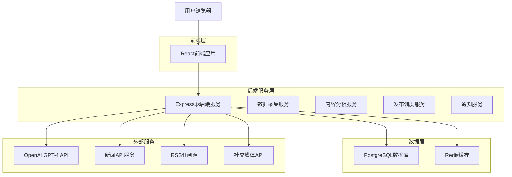
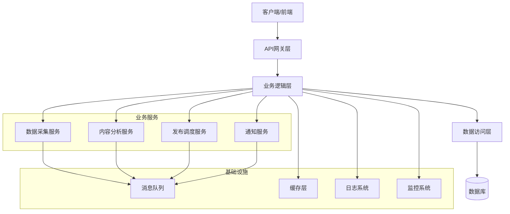
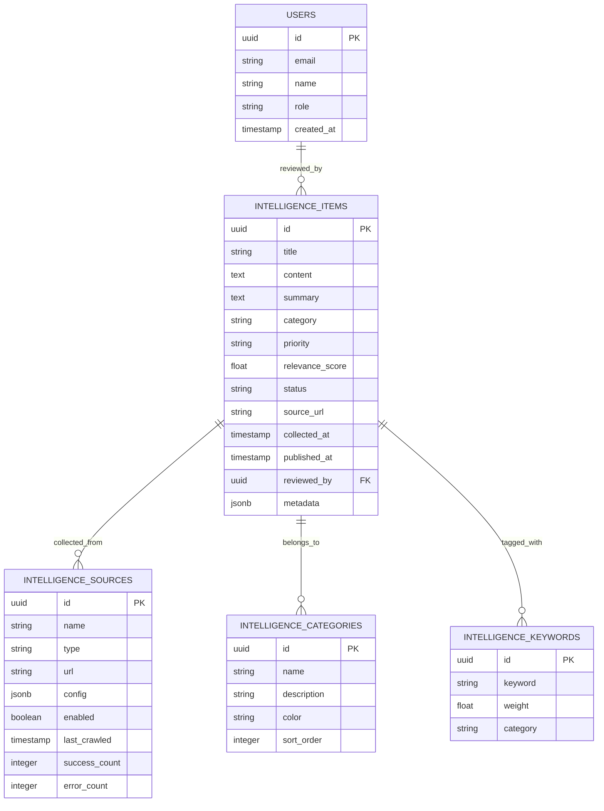

# 自动化情报收集系统技术架构文档

## 1. 架构设计



## 2. 技术描述

- **前端**: React@18 + TypeScript + Tailwind CSS + Vite
- **后端**: Node.js + Express@4 + TypeScript
- **数据库**: PostgreSQL@15 + Redis@7
- **AI服务**: OpenAI GPT-4 API
- **任务调度**: node-cron + Bull Queue
- **爬虫引擎**: Puppeteer + Cheerio
- **部署**: Docker + Docker Compose

## 3. 路由定义

| 路由 | 用途 |
|------|------|
| /admin/intelligence | 情报管理后台，显示自动收集的情报列表和状态 |
| /admin/sources | 数据源管理，配置和监控各种数据源 |
| /admin/settings | 系统设置，配置AI参数和发布规则 |
| /admin/analytics | 数据分析，显示系统性能和内容质量指标 |
| /intelligence | 前台情报展示页面，用户查看最新情报 |
| /intelligence/:id | 情报详情页面，显示完整的情报内容 |

## 4. API定义

### 4.1 核心API

#### 情报管理相关
```
GET /api/intelligence
```
获取情报列表

请求参数:
| 参数名 | 参数类型 | 是否必需 | 描述 |
|--------|----------|----------|------|
| page | number | false | 页码，默认1 |
| limit | number | false | 每页数量，默认20 |
| category | string | false | 分类筛选 |
| priority | string | false | 优先级筛选 |

响应:
| 参数名 | 参数类型 | 描述 |
|--------|----------|------|
| data | array | 情报列表 |
| total | number | 总数量 |
| page | number | 当前页码 |

示例:
```json
{
  "data": [
    {
      "id": "uuid",
      "title": "特斯拉Q4销量创新高",
      "summary": "特斯拉第四季度全球交付量达到48.4万辆...",
      "category": "market",
      "priority": "high",
      "source": "Reuters",
      "publishedAt": "2024-01-15T10:30:00Z",
      "status": "published"
    }
  ],
  "total": 150,
  "page": 1
}
```

#### 数据源管理
```
POST /api/sources
```
添加新数据源

请求:
| 参数名 | 参数类型 | 是否必需 | 描述 |
|--------|----------|----------|------|
| name | string | true | 数据源名称 |
| type | string | true | 类型：rss/api/social |
| url | string | true | 数据源URL |
| keywords | array | false | 关键词列表 |
| enabled | boolean | false | 是否启用，默认true |

响应:
| 参数名 | 参数类型 | 描述 |
|--------|----------|------|
| success | boolean | 操作是否成功 |
| sourceId | string | 新创建的数据源ID |

#### 内容分析
```
POST /api/analyze
```
手动触发内容分析

请求:
| 参数名 | 参数类型 | 是否必需 | 描述 |
|--------|----------|----------|------|
| content | string | true | 待分析的内容 |
| source | string | false | 内容来源 |

响应:
| 参数名 | 参数类型 | 描述 |
|--------|----------|------|
| relevance | number | 相关性评分 (0-100) |
| priority | string | 优先级 (high/medium/low) |
| category | string | 自动分类 |
| summary | string | AI生成的摘要 |
| keywords | array | 提取的关键词 |

## 5. 服务器架构图



## 6. 数据模型

### 6.1 数据模型定义



### 6.2 数据定义语言

#### 情报内容表 (intelligence_items)
```sql
-- 创建表
CREATE TABLE intelligence_items (
    id UUID PRIMARY KEY DEFAULT gen_random_uuid(),
    title VARCHAR(500) NOT NULL,
    content TEXT,
    summary TEXT,
    category VARCHAR(50),
    priority VARCHAR(20) DEFAULT 'medium' CHECK (priority IN ('high', 'medium', 'low')),
    relevance_score FLOAT DEFAULT 0,
    status VARCHAR(20) DEFAULT 'pending' CHECK (status IN ('pending', 'approved', 'published', 'rejected')),
    source_url TEXT,
    source_id UUID REFERENCES intelligence_sources(id),
    collected_at TIMESTAMP WITH TIME ZONE DEFAULT NOW(),
    published_at TIMESTAMP WITH TIME ZONE,
    reviewed_by UUID REFERENCES users(id),
    metadata JSONB DEFAULT '{}',
    created_at TIMESTAMP WITH TIME ZONE DEFAULT NOW(),
    updated_at TIMESTAMP WITH TIME ZONE DEFAULT NOW()
);

-- 创建索引
CREATE INDEX idx_intelligence_items_category ON intelligence_items(category);
CREATE INDEX idx_intelligence_items_priority ON intelligence_items(priority);
CREATE INDEX idx_intelligence_items_status ON intelligence_items(status);
CREATE INDEX idx_intelligence_items_collected_at ON intelligence_items(collected_at DESC);
CREATE INDEX idx_intelligence_items_relevance_score ON intelligence_items(relevance_score DESC);
CREATE INDEX idx_intelligence_items_source_id ON intelligence_items(source_id);

-- 全文搜索索引
CREATE INDEX idx_intelligence_items_search ON intelligence_items USING gin(to_tsvector('chinese', title || ' ' || COALESCE(summary, '')));
```

#### 数据源表 (intelligence_sources)
```sql
-- 创建表
CREATE TABLE intelligence_sources (
    id UUID PRIMARY KEY DEFAULT gen_random_uuid(),
    name VARCHAR(200) NOT NULL,
    type VARCHAR(20) NOT NULL CHECK (type IN ('rss', 'api', 'social', 'manual')),
    url TEXT,
    config JSONB DEFAULT '{}',
    enabled BOOLEAN DEFAULT true,
    last_crawled TIMESTAMP WITH TIME ZONE,
    success_count INTEGER DEFAULT 0,
    error_count INTEGER DEFAULT 0,
    created_at TIMESTAMP WITH TIME ZONE DEFAULT NOW(),
    updated_at TIMESTAMP WITH TIME ZONE DEFAULT NOW()
);

-- 创建索引
CREATE INDEX idx_intelligence_sources_type ON intelligence_sources(type);
CREATE INDEX idx_intelligence_sources_enabled ON intelligence_sources(enabled);
CREATE INDEX idx_intelligence_sources_last_crawled ON intelligence_sources(last_crawled DESC);
```

#### 分类表 (intelligence_categories)
```sql
-- 创建表
CREATE TABLE intelligence_categories (
    id UUID PRIMARY KEY DEFAULT gen_random_uuid(),
    name VARCHAR(100) NOT NULL UNIQUE,
    description TEXT,
    color VARCHAR(7) DEFAULT '#3B82F6',
    sort_order INTEGER DEFAULT 0,
    created_at TIMESTAMP WITH TIME ZONE DEFAULT NOW()
);

-- 初始化数据
INSERT INTO intelligence_categories (name, description, color, sort_order) VALUES
('market', '市场动态', '#10B981', 1),
('technology', '技术创新', '#3B82F6', 2),
('policy', '政策法规', '#F59E0B', 3),
('company', '企业动态', '#8B5CF6', 4),
('supply_chain', '供应链', '#EF4444', 5),
('investment', '投资融资', '#06B6D4', 6);
```

#### 关键词表 (intelligence_keywords)
```sql
-- 创建表
CREATE TABLE intelligence_keywords (
    id UUID PRIMARY KEY DEFAULT gen_random_uuid(),
    keyword VARCHAR(100) NOT NULL,
    weight FLOAT DEFAULT 1.0,
    category VARCHAR(50),
    created_at TIMESTAMP WITH TIME ZONE DEFAULT NOW()
);

-- 创建索引
CREATE INDEX idx_intelligence_keywords_keyword ON intelligence_keywords(keyword);
CREATE INDEX idx_intelligence_keywords_category ON intelligence_keywords(category);

-- 初始化关键词数据
INSERT INTO intelligence_keywords (keyword, weight, category) VALUES
('电动车', 2.0, 'core'),
('新能源汽车', 2.0, 'core'),
('特斯拉', 1.8, 'company'),
('比亚迪', 1.8, 'company'),
('蔚来', 1.5, 'company'),
('小鹏', 1.5, 'company'),
('理想', 1.5, 'company'),
('电池技术', 1.7, 'technology'),
('自动驾驶', 1.6, 'technology'),
('充电桩', 1.4, 'infrastructure'),
('补贴政策', 1.3, 'policy'),
('碳中和', 1.2, 'policy');
```

#### 用户表 (users)
```sql
-- 创建表
CREATE TABLE users (
    id UUID PRIMARY KEY DEFAULT gen_random_uuid(),
    email VARCHAR(255) UNIQUE NOT NULL,
    name VARCHAR(100) NOT NULL,
    role VARCHAR(20) DEFAULT 'editor' CHECK (role IN ('admin', 'editor', 'viewer')),
    created_at TIMESTAMP WITH TIME ZONE DEFAULT NOW(),
    updated_at TIMESTAMP WITH TIME ZONE DEFAULT NOW()
);

-- 创建索引
CREATE INDEX idx_users_email ON users(email);
CREATE INDEX idx_users_role ON users(role);

-- 初始化管理员用户
INSERT INTO users (email, name, role) VALUES
('admin@china-ev-intelligence.com', '系统管理员', 'admin');
```

#### 任务队列表 (job_queue)
```sql
-- 创建表
CREATE TABLE job_queue (
    id UUID PRIMARY KEY DEFAULT gen_random_uuid(),
    type VARCHAR(50) NOT NULL,
    data JSONB NOT NULL,
    status VARCHAR(20) DEFAULT 'pending' CHECK (status IN ('pending', 'processing', 'completed', 'failed')),
    priority INTEGER DEFAULT 0,
    attempts INTEGER DEFAULT 0,
    max_attempts INTEGER DEFAULT 3,
    scheduled_at TIMESTAMP WITH TIME ZONE DEFAULT NOW(),
    started_at TIMESTAMP WITH TIME ZONE,
    completed_at TIMESTAMP WITH TIME ZONE,
    error_message TEXT,
    created_at TIMESTAMP WITH TIME ZONE DEFAULT NOW()
);

-- 创建索引
CREATE INDEX idx_job_queue_status ON job_queue(status);
CREATE INDEX idx_job_queue_type ON job_queue(type);
CREATE INDEX idx_job_queue_scheduled_at ON job_queue(scheduled_at);
CREATE INDEX idx_job_queue_priority ON job_queue(priority DESC);
```

## 7. 权限设置

### 7.1 数据库权限
```sql
-- 为匿名用户授予基本读取权限
GRANT SELECT ON intelligence_items TO anon;
GRANT SELECT ON intelligence_categories TO anon;

-- 为认证用户授予完整权限
GRANT ALL PRIVILEGES ON intelligence_items TO authenticated;
GRANT ALL PRIVILEGES ON intelligence_sources TO authenticated;
GRANT ALL PRIVILEGES ON intelligence_categories TO authenticated;
GRANT ALL PRIVILEGES ON intelligence_keywords TO authenticated;
GRANT ALL PRIVILEGES ON job_queue TO authenticated;
```

### 7.2 行级安全策略
```sql
-- 启用行级安全
ALTER TABLE intelligence_items ENABLE ROW LEVEL SECURITY;

-- 公开已发布的情报
CREATE POLICY "公开已发布情报" ON intelligence_items
    FOR SELECT USING (status = 'published');

-- 管理员可以访问所有数据
CREATE POLICY "管理员全权限" ON intelligence_items
    FOR ALL USING (auth.jwt() ->> 'role' = 'admin');
```