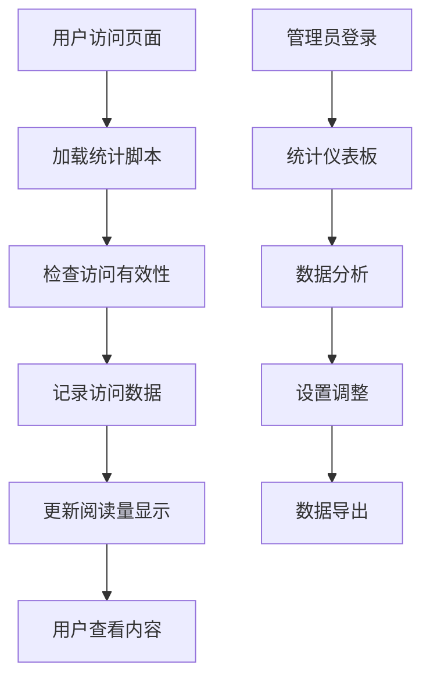

# 阅读量统计系统需求文档

## 1. 产品概述

为中国新能源汽车情报网站添加阅读量统计功能，帮助网站管理员了解文章和页面的访问情况，优化内容策略。系统需要适配静态网站部署环境，提供准确的访问数据统计和用户友好的展示界面。

- 解决问题：缺乏访问数据洞察，无法了解内容受欢迎程度和用户行为
- 目标用户：网站管理员、内容创作者
- 产品价值：提供数据驱动的内容优化依据，提升用户体验

## 2. 核心功能

### 2.1 用户角色

| 角色 | 访问方式 | 核心权限 |
|------|----------|----------|
| 普通访客 | 直接访问 | 触发阅读量统计，查看公开的阅读数据 |
| 网站管理员 | 管理后台 | 查看详细统计数据，管理统计设置 |

### 2.2 功能模块

我们的阅读量统计系统包含以下主要功能：
1. **统计收集页面**：自动记录页面访问、文章阅读、用户行为数据
2. **数据展示页面**：阅读量显示、统计图表、热门内容排行
3. **管理控制页面**：统计设置、数据导出、防刷配置

### 2.3 页面详情

| 页面名称 | 模块名称 | 功能描述 |
|----------|----------|----------|
| 文章详情页 | 阅读量显示 | 显示当前文章阅读次数，实时更新统计数据 |
| 文章详情页 | 统计收集 | 记录页面访问时间、停留时长、来源信息 |
| 首页 | 热门文章 | 展示阅读量最高的文章列表，支持时间筛选 |
| 统计仪表板 | 数据概览 | 显示总访问量、今日访问、热门页面等关键指标 |
| 统计仪表板 | 图表分析 | 访问趋势图、来源分析、设备统计等可视化数据 |
| 管理设置页 | 统计配置 | 设置统计规则、防刷参数、数据保留期限 |
| 管理设置页 | 数据导出 | 支持CSV、JSON格式的数据导出功能 |

## 3. 核心流程

**普通用户流程：**
用户访问网站 → 页面加载统计脚本 → 记录访问数据 → 更新阅读量显示 → 用户查看统计信息

**管理员流程：**
登录管理后台 → 查看统计仪表板 → 分析访问数据 → 调整统计设置 → 导出数据报告

## 4. 用户界面设计

### 4.1 设计风格

- **主色调**：#2563eb（蓝色）、#64748b（灰色）
- **按钮样式**：圆角按钮，悬停效果
- **字体**：系统默认字体，阅读量数字使用等宽字体
- **布局风格**：简洁卡片式设计，响应式布局
- **图标风格**：线性图标，统一的视觉语言

### 4.2 页面设计概览

| 页面名称 | 模块名称 | UI元素 |
|----------|----------|--------|
| 文章详情页 | 阅读量显示 | 眼睛图标 + 数字，位于文章标题下方，字体大小14px，颜色#64748b |
| 统计仪表板 | 数据卡片 | 白色背景卡片，圆角8px，阴影效果，包含图标、数值、标题 |
| 统计仪表板 | 图表区域 | Chart.js图表，蓝色主题，响应式设计，支持交互 |
| 热门文章列表 | 排行榜 | 序号 + 文章标题 + 阅读量，悬停高亮效果 |

### 4.3 响应式设计

桌面优先设计，移动端自